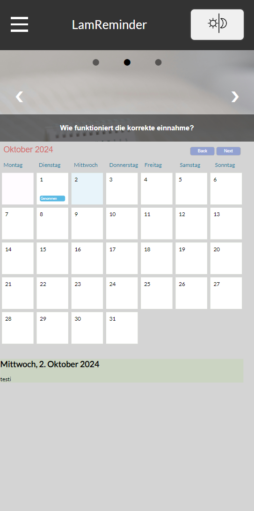

# 💊 LamReminder

A reminder app for your mobile phone for Lamuna20

## ✔️ ToDo´s

Informationstexte auf der Infoseite schöner einblenden

Screen für Einstellungen

Screen für Profil

Screen für Login (Formular)

~~Header über die ganze Seite ziehen~~

Kamera zugriff für´s Profilbild

~~Slideshow unterhalb der nav einblenden~~

Farben für Light- und Darkmode anpassen

Namen im code (z.B für klassennamen usw) alle einheitlich auf englisch

## 🕑 Current status of the main page

